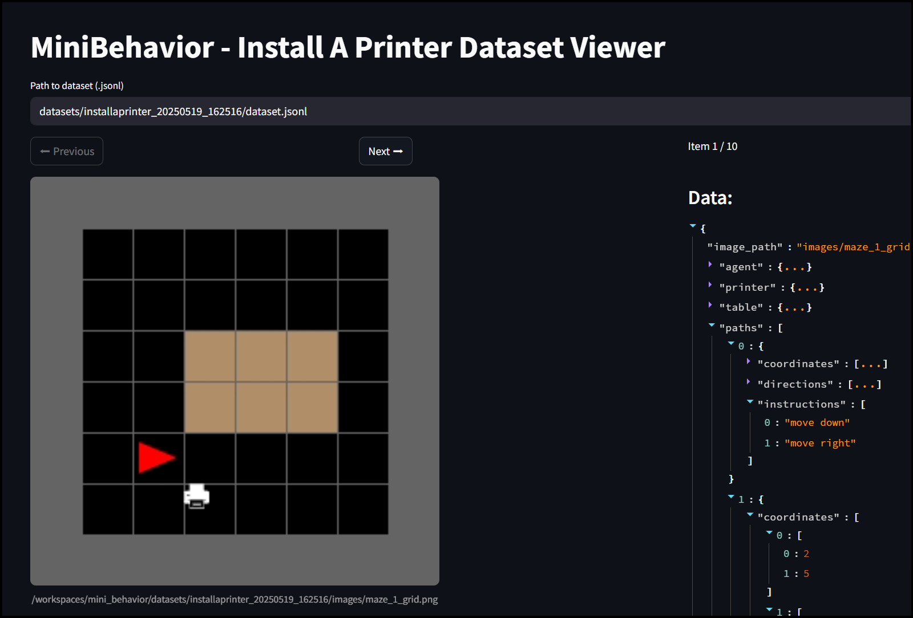

# Mini-BEHAVIOR

Generate datasets from the Install A Printer task of Mini Behavior.

Link to paper: https://arxiv.org/abs/2310.01824

## Setup

```sh
uv sync
```

## Run Tests

```sh
uv run pytest -v
```

## Generate Dataset

```sh
uv run generate_dataset.py
```

Inputs: Image of Grid + Path from Agent to Printer

## Example Path

```json
{
    "coordinates": [
    [
        2,
        5
    ],
    [
        2,
        6
    ],
    [
        3,
        6
    ]
    ],
    "directions": [
    "down",
    "right"
    ],
    "instructions": [
    "move down",
    "move right"
    ]
}
```

## Visualize Dataset

```sh
uv run streamlit run visualize_dataset.py \
-- datasets/installaprinter_20250519_162516/dataset.jsonl
```

### Example


